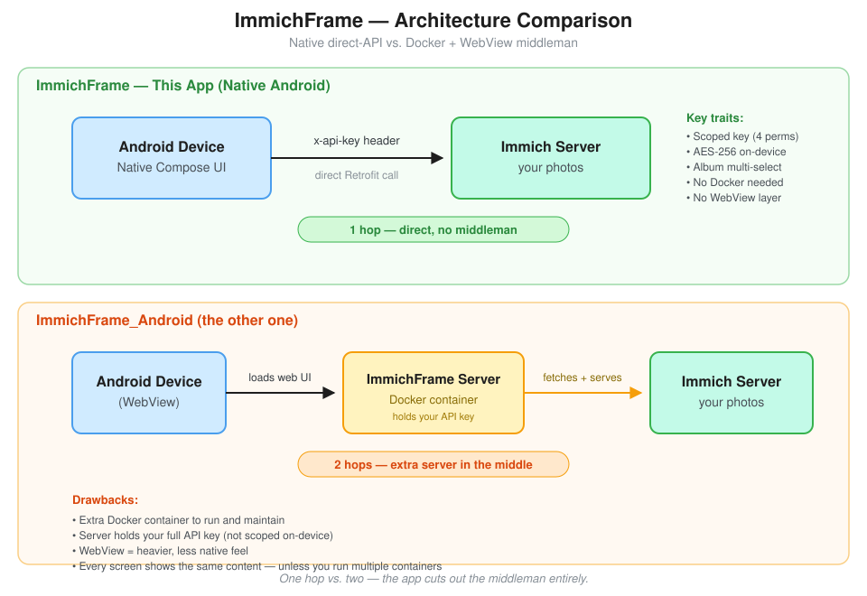

# ImmichFrame — Native Android Photo Frame for Immich

A native Android slideshow app that connects directly to your Immich server.
No intermediary Docker container, no WebView, no second API key.

## Why?

[ImmichFrame_Android](https://github.com/immichFrame/ImmichFrame_Android) uses
a server+client architecture where a Docker container holds your Immich API
key and serves a web UI that the Android app loads in a WebView. This only
makes sense if every screen in your house shows the same content. For a
single photo frame, it's unnecessary complexity.

This app talks to the Immich API directly using `x-api-key` authentication,
lets you pick which album(s) to display, and remembers your choice.

> The source for this diagram is in [`docs/architecture-comparison.excalidraw`](docs/architecture-comparison.excalidraw) — open it at [excalidraw.com](https://excalidraw.com) to edit.

## Features

- Direct Immich API access (no middleman server)
- Native Jetpack Compose UI (no WebView)
- Album picker with multi-select
- Fullscreen slideshow with crossfade transitions
- Configurable interval, transition speed, fill mode (Contain/Cover)
- Video playback with mute and skip options (Media3/ExoPlayer)
- Draggable clock overlay with configurable size and snap-to-grid
- Photo animations (Ken Burns: zoom in/out, pan left/right/up/down, or random) — also serves as burn-in protection
- Adaptive background (fills letterbox bars with each photo's dominant color)
- Shuffle mode for randomized image order
- Progress bar showing time remaining per image
- Start on boot (with OEM autostart permission detection)
- Self-update via GitHub releases (sideloaded installs only)
- Auto-resumes last album on launch
- Localized into 13 languages (en, ar, zh, nl, fr, de, it, ja, ko, pl, pt, ru, es)
- Scoped API key (4 permissions only: album.read, asset.read, asset.view, user.read)
- API key stored encrypted on-device (AES-256, Android Keystore)

## Setup

1. Create an API key in Immich: User Settings > API Keys
   (requires `album.read`, `asset.read`, `asset.view`, `user.read`)
2. Enter server URL + API key in the app
3. Select album(s)
4. Slideshow starts

## Tech Stack

Kotlin 2.1 · Jetpack Compose · Retrofit 2 · Coil 3 · Media3 ExoPlayer · Hilt · DataStore · Palette

## Requirements

- Immich server (v1.120+; v3 supported, see API docs for a query-param caveat)
- Android 8.0+ (API 26)
- JDK 17 for building

## Documentation

- [Overview](docs/overview.md) — goals and architecture
- [Functional Spec](docs/functional-spec.md) — features and user flows
- [Technical Spec](docs/technical-spec.md) — tech stack, data flow, state persistence
- [API Reference](docs/api-reference.md) — Immich API endpoints used
- [UI Spec](docs/ui-spec.md) — screen layouts
- [CI/CD](docs/ci-cd.md) — branching, build workflows, signing

## License

MIT
